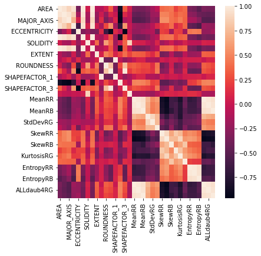
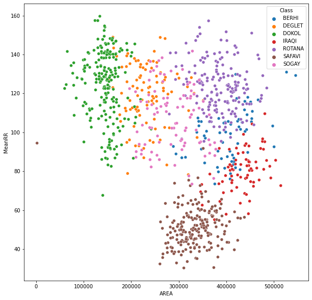
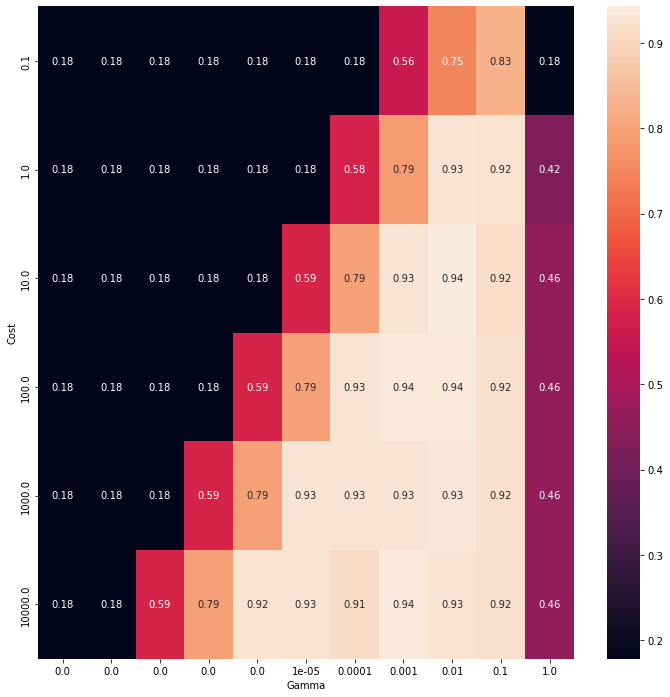
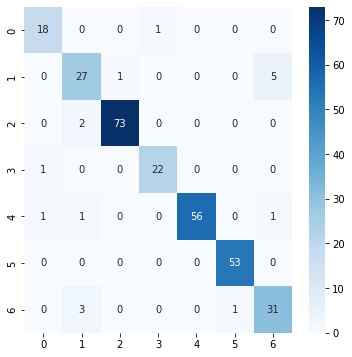

# Date Fruit Classification - SVM


```python
import pandas as pd
import matplotlib.pyplot as plt 
import numpy as np

# sklearn
from sklearn import datasets
from sklearn.model_selection import KFold
from sklearn import metrics
from sklearn.model_selection import train_test_split
from sklearn.metrics import classification_report,confusion_matrix

import seaborn as sns
```


```python
date_df = pd.read_csv("date_fruit.csv")
```


```python
date_df.info()
```

    <class 'pandas.core.frame.DataFrame'>
    RangeIndex: 898 entries, 0 to 897
    Data columns (total 35 columns):
     #   Column         Non-Null Count  Dtype  
    ---  ------         --------------  -----  
     0   AREA           898 non-null    int64  
     1   PERIMETER      898 non-null    float64
     2   MAJOR_AXIS     898 non-null    float64
     3   MINOR_AXIS     898 non-null    float64
     4   ECCENTRICITY   898 non-null    float64
     5   EQDIASQ        898 non-null    float64
     6   SOLIDITY       898 non-null    float64
     7   CONVEX_AREA    898 non-null    int64  
     8   EXTENT         898 non-null    float64
     9   ASPECT_RATIO   898 non-null    float64
     10  ROUNDNESS      898 non-null    float64
     11  COMPACTNESS    898 non-null    float64
     12  SHAPEFACTOR_1  898 non-null    float64
     13  SHAPEFACTOR_2  898 non-null    float64
     14  SHAPEFACTOR_3  898 non-null    float64
     15  SHAPEFACTOR_4  898 non-null    float64
     16  MeanRR         898 non-null    float64
     17  MeanRG         898 non-null    float64
     18  MeanRB         898 non-null    float64
     19  StdDevRR       898 non-null    float64
     20  StdDevRG       898 non-null    float64
     21  StdDevRB       898 non-null    float64
     22  SkewRR         898 non-null    float64
     23  SkewRG         898 non-null    float64
     24  SkewRB         898 non-null    float64
     25  KurtosisRR     898 non-null    float64
     26  KurtosisRG     898 non-null    float64
     27  KurtosisRB     898 non-null    float64
     28  EntropyRR      898 non-null    float64
     29  EntropyRG      898 non-null    int64  
     30  EntropyRB      898 non-null    int64  
     31  ALLdaub4RR     898 non-null    float64
     32  ALLdaub4RG     898 non-null    float64
     33  ALLdaub4RB     898 non-null    float64
     34  Class          898 non-null    object 
    dtypes: float64(30), int64(4), object(1)
    memory usage: 245.7+ KB
    


```python
plt.figure(figsize=(6,6))
sns.heatmap(date_df.corr())
plt.show()
```


    

    


```python
plt.figure(figsize=(10,10))
sns.scatterplot(x=date_df.AREA, y=date_df.MeanRR, hue=date_df.Class)
plt.show()
```


    

    


### Preprocess data


```python
from sklearn import preprocessing

scaler = preprocessing.StandardScaler().fit(date_df.iloc[:,:34]) # all data except for the class

X = scaler.transform(date_df.iloc[:,:34])
```


```python
# Split up data

y = date_df.iloc[:,34] # Class

# set up k-fold, k = 5

kf = KFold(n_splits=5, shuffle=True, random_state=42)
```


```python
X = pd.DataFrame(X) # Convert to Data Frame
```

### Split up data for training and testing


```python
X_train, X_test, y_train, y_test = train_test_split(X, y, test_size=0.33, random_state=42)
```

### SVM with hyperparamter optimization (Grid search)


```python
# SVM (rbf)

# Gamma paramters

gamma_p = float(10)**np.arange(-10, 1)

# Cost parameters

C_p = float(10)**np.arange(-1, 5)

# accuracy matrix

mdl_acc = np.zeros((len(C_p), len(gamma_p)))

from sklearn import svm

for i, C in enumerate(C_p):
    for j, gamma in enumerate(gamma_p):
        mdl = svm.SVC(kernel="rbf", gamma=gamma, C=C)

        mdl.fit(X_train,y_train)
        prd=mdl.predict(X_test)
        
        mdl_acc[i, j] = metrics.accuracy_score(prd, y_test) # insert accuracy score
```


```python
# Convert to Data Frame

mdl_df = pd.DataFrame(mdl_acc)

# Rename rows and columns

mdl_df.columns = gamma_p.round(5) 
mdl_df.index = C_p
```


```python
# Accuracy Heatmap

plt.figure(figsize=(12,12))
sns.heatmap(mdl_df, annot=True)
plt.xlabel("Gamma")
plt.ylabel("Cost")
plt.show()
```


    

    


```python
# Parameters based on grid search

mdl = svm.SVC(kernel="rbf", gamma=0.01, C=10.0)

mdl.fit(X_train,y_train)
prd=mdl.predict(X_test)
```


```python
results = pd.DataFrame(confusion_matrix(y_test, prd))
```


```python
# Confusion matrix plot

plt.figure(figsize=(6,6))
sns.heatmap(results, annot=True, cmap='Blues') 
plt.show()
```


    

    


```python
# Accuracy

metrics.accuracy_score(prd, y_test)
```


    0.9427609427609428


```python
# Classification report

print(mdl," Classification Report \n",classification_report(prd,y_test,target_names=date_df["Class"].unique()),"\n")
```

    SVC(C=10.0, gamma=0.01)  Classification Report 
                   precision    recall  f1-score   support
    
           BERHI       0.95      0.90      0.92        20
          DEGLET       0.82      0.82      0.82        33
           DOKOL       0.97      0.99      0.98        74
           IRAQI       0.96      0.96      0.96        23
          ROTANA       0.95      1.00      0.97        56
          SAFAVI       1.00      0.98      0.99        54
           SOGAY       0.89      0.84      0.86        37
    
        accuracy                           0.94       297
       macro avg       0.93      0.93      0.93       297
    weighted avg       0.94      0.94      0.94       297
     
    
    

### K-fold accuracy test (k=5)


```python
acc = [] # accuracy array

for i, (itr, its) in enumerate(kf.split(X)):
    Xtr, Xts = X.iloc[itr,:], X.iloc[its,:]
    ytr, yts = y[itr], y[its]
    
    mdl.fit(Xtr, ytr)
    prd = mdl.predict(Xts)
    print("Fold", i+1, " Accuracy:", metrics.accuracy_score(prd, yts))
    acc.append(metrics.accuracy_score(prd, yts))

print("Mean Accuracy:", round(np.mean(acc), 3))
```

    Fold 1  Accuracy: 0.9555555555555556
    Fold 2  Accuracy: 0.9222222222222223
    Fold 3  Accuracy: 0.8833333333333333
    Fold 4  Accuracy: 0.9106145251396648
    Fold 5  Accuracy: 0.9217877094972067
    Mean Accuracy: 0.919
    
